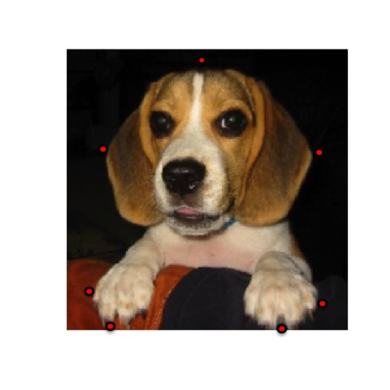
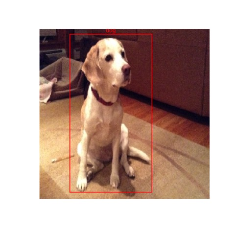
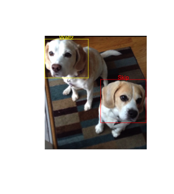

```{r message=FALSE, warning=FALSE, echo=TRUE}
library(boundingbox)
```

### Intro
When we create bounding boxes in images, particularly if we intend to feed them into predictive models for object localization and classification, we are often:

* Processing many images
* Classifying the contents of the bounding boxes
* Standardizing the size of the images
* Capturing the coordinates

The **boundingbox** package v1.0.1 which was just recently released on CRAN supports these activities in efficient and effective ways:

* It allows you to stream your images from a directory for processing, in batches if desired.
* It allows you to set a common classifier for all images, or select a classifier per bounding box.
* It allows you to resize all of the output images to be the same.
* It outputs a dataframe of the coordinates along with other metadata points.

There are two primary functions **boxer** and **boxer2** to generate bounding boxes, and the auxiliary function **outBox** to output the images. 


### Examples

The **boxer** function allows you to stream through images and select between 2 and 26 points around which a bounding box is generated in each image. You can set a common classifier for all of the images.

``` {r, echo = TRUE, eval = FALSE}
box_coords <-
    boxer(
    names = c("S2.jpg", "W1.jpg"),
    file_path_input = system.file("extdata",    package = "boundingbox"),
    file_path_output = tempdir(),
    classifier = "dog",
    show_classifier = TRUE,
    resize_x = 224,
    resize_y = 224,
    outbox = TRUE
    )
```
When an image appears, use the left mouse button to select a point, and the right mouse button to signal completion and to move to the next image. To skip through any of the images, use the right mouse button prior to selecting any points with the left button. If the selected point goes out of the bounds of the image, the x and/or y coordinate is adjusted to the nearest set of coordinates on the inside edge of the image. 

Here is a screen shot of the first image with several points selected. 

```{r, echo = FALSE, out.width = "500px"}

```


This is the output file generated with a bounding box based on the selected points.
```{r, echo = FALSE, out.width = "500px"}
knitr::include_graphics("boundingbox_files/README-output-1.jpg")
```


Here is a screen shot of the second streamed image with two points selected. 
```{r, echo = FALSE, out.width = "500px"}
knitr::include_graphics("boundingbox_files/README-input-2.jpg")
```


This is the second output file generated with a bounding box based on the selected points.
```{r, echo = FALSE, out.width = "500px"}

```

The resulting data frame will have the bounding box coordinates, the classifier, the image width and height, and box color for each of the images. Note that the y-coordinate extends from the top down, instead of the bottom up for these images. 

box_coords
```{r echo=FALSE, eval=TRUE}
box_coords <- data.frame(file_name = c("S2.jpg", "W1.jpg"), x_left = c(19,41), y_top = c(9,5), x_right = c(201, 149), y_bottom = c(223, 216), size_x = c(224, 224), size_y = c(224,224), classifier = "dog", color = "red", stringsAsFactors = FALSE)
box_coords
```


The **boxer2** function streams images for point capture in the same way as **boxer** does, however it provides the options to add multiple bounding boxes per image, and to select separate classifiers per bounding box. As input, it requires a data frame that defines the classifiers that will be used.  You will be prompted to provide the classifier ref # for each of the boxes. 

``` {r, echo = TRUE, eval = FALSE}
dog_df <-
    data.frame(
    ref = (1:2),
    class = c("Skip", "Waltz"),
    color = c("red", "yellow"),
    stringsAsFactors = FALSE
    )

box_coords2 <-
    boxer2(
    names = c("SW1.png"),
    file_path_input = system.file("extdata",    package = "boundingbox"),
    file_path_output = tempdir(),
    classifier = dog_df,
    show_classifier = TRUE,
    outbox = TRUE
    )
```

Here is an example of output from the boxer2 function.

```{r, echo = FALSE, out.width = "500px"}

```

box_coords2
```{r echo=FALSE, eval=TRUE}
box_coords2 <- data.frame(file_name = c("SW1.png", "SW1.png"), x_left = c(0, 157), y_top = c(9, 123), x_right = c(122, 284), y_bottom = c(110, 245), size_x = c(286, 286), size_y = c(320, 320), classifier = c("Waltz", "Skip"), color = c("yellow", "red"), stringsAsFactors = FALSE)
box_coords2
```

Note with both functions it is possible to output just the data frame with bounding box coordinates and not the output images by using the default **outbox = FALSE** setting.  You can separately produce the image files by feeding a data frame with bounding box coordinates to the **outBox** function.


### Installation

**boundingbox** can be installed from CRAN or Github.

####CRAN
``` {r, echo = TRUE, eval = FALSE}
install.packages("boundingbox")
```


####Github
``` {r, echo = TRUE, eval = FALSE}
library(devtools)
install_github("stomperusa/boundingbox")
```