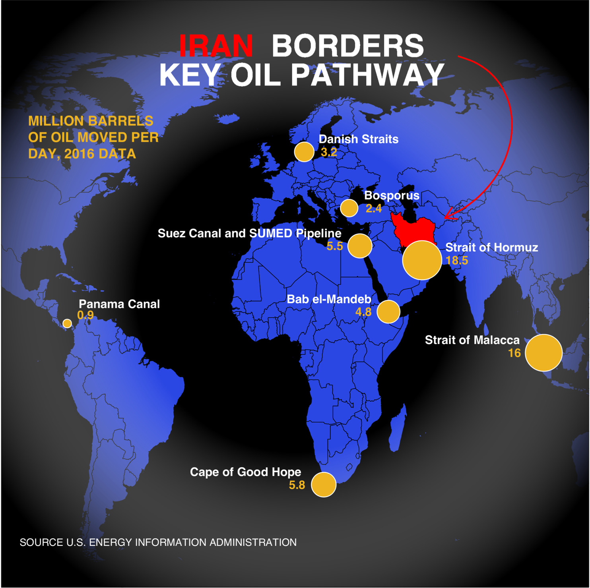
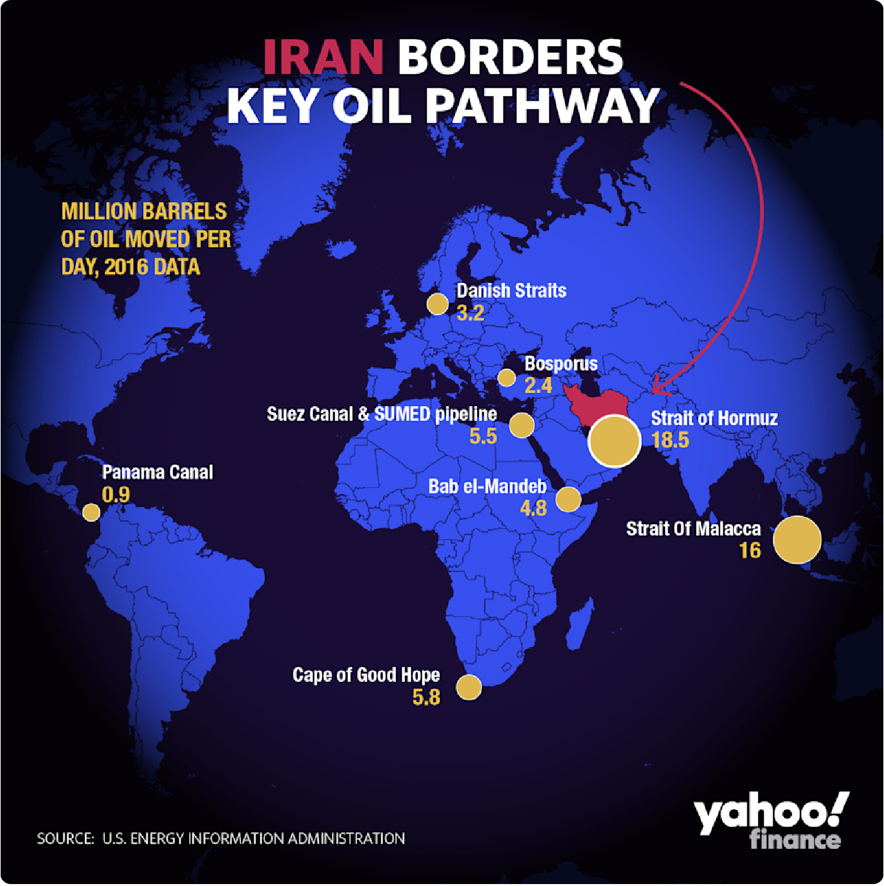

### Intro
Early last year I posted on my blog an attempt to recreate a Yahoo Finance graphic. Now, thanks to the work of Dr Paul Murrell on the **grid** and **gggrid** packages, I have the tools to polish this one off.  [Reference Article](https://developer.r-project.org/Blog/public/2020/07/15/new-features-in-the-r-graphics-engine/ "New Features in the R Graphics Engine")

Here is a streamlined version of my earlier post, and the graphic enhanced by the radial gradient feature. 

### My attempt to replicate

```{r, echo = FALSE, out.width = "500px"}

```


### The original file

```{r, echo = FALSE, out.width = "500px"}

```

[Source Article](https://finance.yahoo.com/news/what-us-iran-tensions-could-mean-for-oil-prices-193905568.html?guccounter=1&guce_referrer=aHR0cHM6Ly93d3cuZ29vZ2xlLmNvbS8&guce_referrer_sig=AQAAADp4Vt8w3NAGpqbj8B0Lj3oLzHjF-R9YqWXZKXiKiabBmEv_8GNYKJeLGytcLIHL1fLnn9Rv886i_Vr07iqAUu4fuZrpm-5goU7ulysC0QjUSEUxWfs1Ax_zinvN3DezuR3zAsWmwSClEXkSGXu9_d-wmCe22K4GKnRjQq7_1d3p "What US-Iran Tensions Could Mean for Oil Prices")


### Required Packages
```{r message=FALSE, warning=FALSE, echo=TRUE}
library(tidyverse)
library(sf)
library(rnaturalearth)
library(rnaturalearthdata)
library(ggtext)
library(grid)
library(gggrid)
```

### The Data
Will cut right to the chase this time. Here are the data elements we need for the map and the points on the map.

```{r message=FALSE, echo=TRUE}
world <- ne_countries(scale = "medium", returnclass = "sf")
data <- data.frame(Location = c("Strait of Hormuz", "Strait of Malacca", 
                                 "Suez Canal and SUMED Pipeline", "Bab el-Mandeb", "Danish Straits", 
                                 "Bosporus", "Panama Canal", "Cape of Good Hope"), 
                    Barrels = c(18.5,16, 5.5, 4.8, 3.2, 2.4, 0.9, 5.8), 
                    Lat = c(26.5667, 1.43, 30.455, 12.5833, 56, 40.7225, 9.38743, -34.3548), 
                    Lon = c(56.25, 102.89, 32.35, 43.3333, 11, 28.2247, -79.91863, 18.4698))
```

### The Graph
Note the limitations on the graphic devices that can be used. Here I will use **cairo_ps** to save the output locally as a postscript file. The additions to achieve the radial gradient are **grid::radialGradient()** and **gggrid::grid_panel()**. 

```{r message=FALSE, echo=TRUE}
# Not Run
#cairo_ps(filename  = "plot2.ps")
#grad <- radialGradient(c("transparent", "black"), r2=.6,  stops = c(.45, 1), extend = "pad")
#title <- "<b style='color:#FF0000'>IRAN</b> <b style='color:#FFFFFF'>BORDERS<br> KEY OIL PATHWAY</b>"
#ggplot(data = world) +
#    geom_sf(fill = "#2B47E3", color = "black", size = 0.2) +
    
#    grid_panel(rectGrob(gp=gpar(fill=grad))) +
    
#    geom_sf(data = subset(world, geounit == "Iran"), fill = "red", color = "black", size = 0.2) +
#    geom_point(data = data, aes(x =Lon, y=Lat, size = Barrels), 
#               shape = 21, fill = "goldenrod2", color = "white", show.legend = F) +
#    geom_text(data = data, aes(x =Lon, y=Lat, label = Location), color = "white", size = 3.5,
#              vjust = c(-1, -1, -1, -1, -1, -1, -1.8, -1), hjust = c(-0.25, 1.25, 1.1, 1.2, -0.18, -0.27, -0.14, 1.2), 
#              fontface = "bold") +
#    geom_text(data = data, aes(x =Lon, y=Lat, label = Barrels), color = "goldenrod2", size = 3.5,
#              vjust = c(.5, .5, .5, .5, .5, .5, -.5, .5), hjust = c(-1.0, 2.7, 2.0, 2.0, -1.0, -1.0, -0.6, 2.1),
#              fontface = "bold") +
#    scale_size_continuous(range = c(3, 15)) +
#    annotate("text", x = -95, y = 60, label = "MILLION BARRELS\nOF OIL MOVED PER\nDAY, 2016 DATA", size = 4.0,
#             color = "goldenrod2", fontface= "bold", hjust = 0, lineheight = 1) +
#    annotate("text", x = -45, y = -50, label = "SOURCE U.S. ENERGY INFORMATION ADMINISTRATION", size = 3.0,
#             color = "white")+
#    geom_richtext(x = 10, y = 80, label = title, size = 9, fill = NA, label.color = NA, lineheight = 0.33) +
#    geom_curve(aes(x = 70, y = 82, xend = 65, yend = 38), color = "red", arrow = arrow(type = "open",
#              length = unit(0.15, "inches")), curvature = -0.75, angle = 100, ncp =10) + 
#    theme(panel.background = element_rect(fill = "black"),
#          panel.grid = element_blank(), axis.title = element_blank(), axis.ticks = element_blank(),
#          axis.text = element_blank(), aspect.ratio = 1) +
#    xlim(-95.00, 110.00) +
#    ylim(-55, 90)
#dev.off()
```
